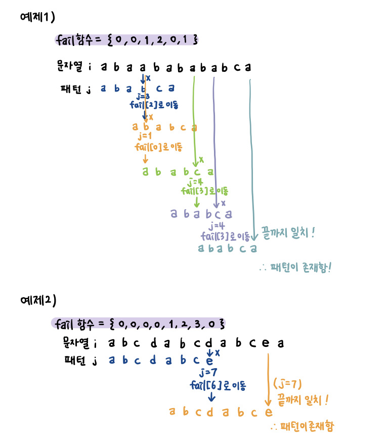

# 💥KMP 알고리즘
## 📘 설명
* Knuth-Morris-Pratt 알고리즘
* 패턴 전처리해서 잘못된 시작을 최소화한다.
* 시간복잡도 : <b>O(N+M)</b>
* 패턴 문자열(찾고자 하는 문자열)을 가지고 실패배열을 만든 후, 이를 통해 전체 문자열에서 패턴 문자열을 찾는 방식이다.
    * 실패배열은 각 위치까지 최대로 일치하는 문자 개수(?)를 저장한 배열이다. 
    * 실패배열을 만든후, 실패배열 만드는 방식과 동일하게 문자열에서 패턴을 찾아가면 된다.

1) 실패함수(배열) 만들기

 

2) 만든 실패함수로 문자열에서 패턴 찾아내기

 
