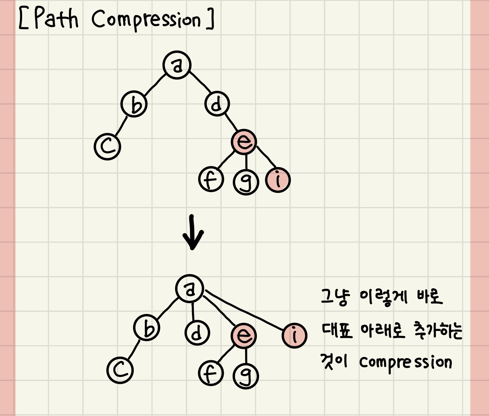
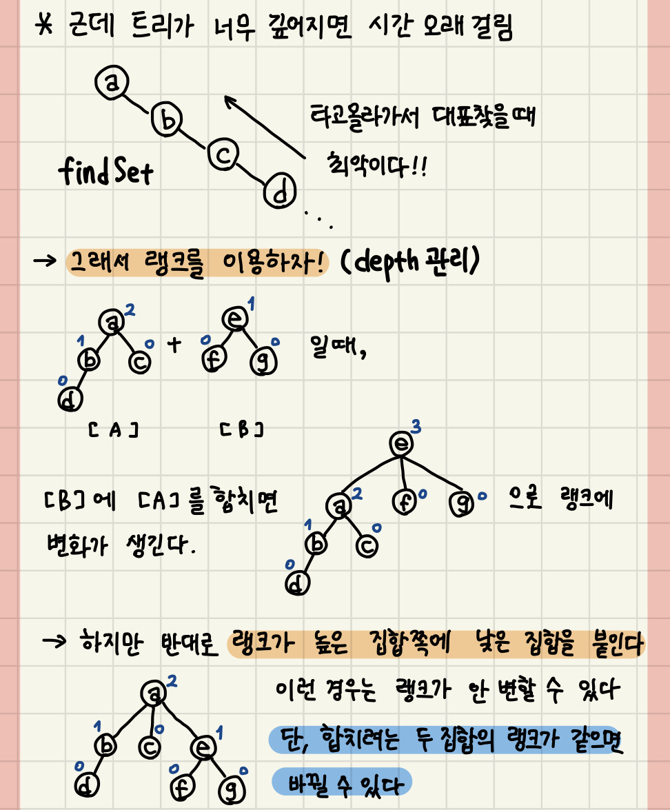

# 💥서로소(Disjoint Set)
## 📘 설명
* 그래프 알고리즘의 일종으로 상호 베타적 집합이라고 한다.
* 교집합이 없는 집합들을 말한다. 그래서 집합에 속한 하나의 특정 멤버를 통해 집합을 구분한다.

### 📌 유니온 파인드
1. makeSet : 각 노드들을 각각의 집합으로 초기화 하는 함수
2. findSet(a) : 노드 a의 루트를 찾는 함수
3. union(a, b) : 노드 a와 노드 b가 속해있는 집합을 합치는 함수

* findSet은 path 압축

 
* union은 rank 압축

  

### 📌 크루스칼 알고리즘